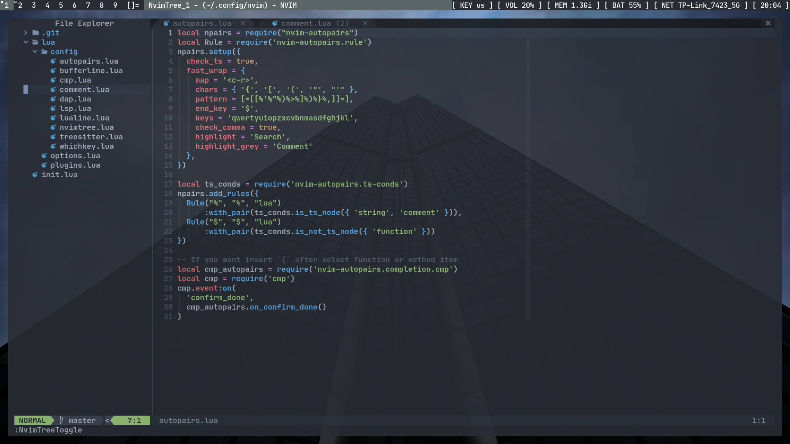
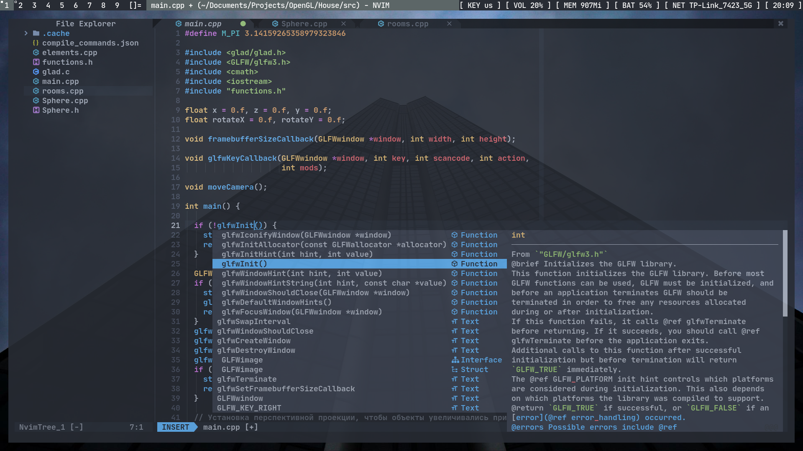

# Screenshots

# List of plugins
Plugin manager:
* wbthomason/packer.nvim

**Lsp support:**
* neovim/nvim-lspconfig
* williamboman/nvim-lsp-installer

**Autocompletion:**
* hrsh7th/nvim-cmp
* hrsh7th/cmp-nvim-lsp
* onsails/lspkind.nvim
* hrsh7th/cmp-nvim-lsp-signature-help
* hrsh7th/cmp-buffer
* hrsh7th/cmp-path

**Dap:**
* mfussenegger/nvim-dap
* rcarriga/nvim-dap-ui

**Snippets:**
* L3MON4D3/LuaSnip
* rafamadriz/friendly-snippets
* saadparwaiz1/cmp_luasnip

**Treesitter:
* nvim-treesitter/nvim-treesitter

**Icons, buffer line, command line, file explorer:**
* kyazdani42/nvim-web-devicons
* kyazdani42/nvim-tree.lua
* akinsho/bufferline.nvim
* nvim-lualine/lualine.nvim

**Colorschemes:**
* tanvirtin/monokai.nvim
* joshdick/onedark.vim
* dracula/vim

**Other useful plugins:**
* fedepujol/move.nvim
* windwp/nvim-autopairs
* numToStr/Comment.nvim
* folke/which-key.nvim
* lukas-reineke/indent-blankline.nvim

# Requirements
You can find requirements for every plugin at their repositories.

# Getting started
Install 

Clone repository:

    git clone https://github.com/hivernal/nvim
    
Install plugin manager packer:
    
    git clone --depth 1 https://github.com/wbthomason/packer.nvim\
    ~/.local/share/nvim/site/pack/packer/start/packer.nvim
 
 Run following neovim command:
    
    PackerSync
